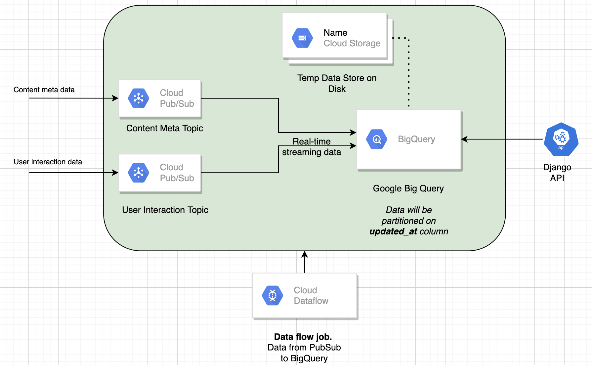

# pratilipi-assignment

## Setup

Clone the repository:

```sh
$ git clone https://github.com/gocardless/sample-django-app.git
$ cd sample-django-app
```

Then install the dependencies:


```sh 
virtualenv env_assignment
(env_assignment)$ pip install -r requirements.txt
```

And navigate to `http://127.0.0.1:8000/user_content/?user_id=65045&query_date=2022-03-27`


## Architecture
<p align="center">

</p>

## Query

Response data from API is query driven. Query is performed on two table which are present inside google big query named <i>user_interaction</i> and <i>content_meta</i>.

query used:

```sh
        select ARRAY_AGG(struct(category_name, category_count)) as json_val from (
            select user_id, category_name, count(*) as category_count from (
                    SELECT A.*, B.category_name from (
                        SELECT * FROM `pratilipi-de-assignment.user_interaction.user_interaction_partitioned` 
                        WHERE updated_at >= '2021-12-13' and updated_at<='2021-12-27' and user_id=6504233704206137 and read_percent>90
                    ) as A
                    inner join 
                    (
                        SELECT * FROM `pratilipi-de-assignment.content_data.content_meta` 
                    ) as B on A.content_id=B.content_id 
            ) group by user_id, category_name
        ) group by user_id
```

API response:
```sh
{
  "detective":0.0015754233950374162,
  "erotica":0.01811736904293029,
  "life":0.03938558487593541,
  "crime":0.00866482867270579,
  "drama":0.02678219771563608,
  "women":0.054352107128790864,
  "family":0.0771957463568334,
  "horror":0.0019692792437967705,
  "novels":0.15596691610870422,
  "social":0.027176053564395432,
  "fantasy":0.0019692792437967705,
  "romance":0.29617959826703427,
  "suspense":0.08507286333202048,
  "swahindi2":0.0019692792437967705,
  "webseries":0.03662859393461993,
  "shortstories":0.024812918471839307,
  "Serieswriting":0.007877116975187082,
  "entertainment":0.020086648286727057,
  "action-and-adventure":0.06498621504529342,
  "Pratilipi-Awards-Hindi":0.04923198109491926
}
```
Suggested solution is based on google cloud platform.
## Components used in data pipeline.
<li> <b>Google Pub/Sub</b>
  <ul> 
    <li> Streaming data ingestion for event data to multiple destinations. 
    <li> Data present at two different source. So two topics are needed (i.e. content-meta and user-interaction).
    <li> To continously ingest data from source to Pus/Sub topic, one need to integrate source with Pub/Sub. I have used Pub/Sub python client module to push sample data for ingestion into Pub/Sub topics.
    <li> Code to push data into Pub/Sub topic:
                  
            
                # To push data into user-interaction topic
                import json
                from google.cloud import pubsub_v1
                project_id = "pratilipi-de-assignment"
                topic_id = "user-interaction"
                publisher = pubsub_v1.PublisherClient()
                topic_path = publisher.topic_path(project_id, topic_id)
                d = { "user_id": 65045, "content_id": 12345, "read_percent": 92, "updated_at": '2022-03-27'}
                data = json.dumps(d).encode("utf-8")
                future = publisher.publish(topic_path, data)

            
                # To push data into content-meta topic
                import json
                from google.cloud import pubsub_v1
                project_id = "pratilipi-de-assignment"
                topic_id = "content-meta"
                publisher = pubsub_v1.PublisherClient()
                topic_path = publisher.topic_path(project_id, topic_id)
                d = {"content_id": 12345, "category_name": "test_cat2" }
                data = json.dumps(d).encode("utf-8")
                future = publisher.publish(topic_path, data)
          

  <li> Data present at PubSub level can also be used as data source for different realtime streaming analytics applications which are dependent on user content interaction.  
    <li> Similar opensource solution: <b> <i> kafka + big query kafka sink connector </i> </b>
  </ul>
</li>
<br>
<li> <b> Google BigQuery </b>
    <ul>
        <li> Create two table named <i>user-interaction</i> and <i>content-meta.</i>
        <li> Upload historical data dump via csv upload into both table.
        <li> Choose auto detect schema option in both table.
        <li> Create partition in <i>user-interaction</i> table on column <i>updated_at</i>. Partitioning can drastically improve query performance. In our query, there is where clause on <i>updated_at</i> column for date range of past two weeks. Partitioning will help in reducing data scan. It will scan only 14 partition (i.e. 14 days) and will output query much faster. 
        <li> Both table can be used for other applications (like analytics tool, dashboards/visualization tool) because data is stored in granular level.
    </ul>
<br>
<li><b> Google Cloud Storage </b>
    <ul>
            <li> Create a bucket named <i>de-assignment-01</i> (any name)
            <li> This bucket will be used to store temporary data from google big query.
    </ul>
<br>
<li> <b> Google Dataflow </b>
    <ul> 
    <li> Google Cloud Dataflow is a cloud-based data processing service for both batch and real-time data streaming applications. 
    <li> Create two dataflow job with the help of inbuilt template named <i> pubsub_to_bigquery </i> with mentioned configuration:
    <li> Subscribe <i>user-interaction</i> topic in Pub/Sub to <i>user-interaction</i> table in bigquery
    <li> First job config:
            <ul>
                 <li> jobName: ps-to-bq-user-interaction_test</i> (any unique name)
                 <li> inputTopic: projects/pratilipi-de-assignment/topics/user-interaction</i>
                 <li> outputTableSpec: pratilipi-de-assignment:user_interaction.user_interaction_partitioned</i>
                 <li> gcpTempLocation: gs://de-assignment-01/test</i>
            </ul>
    <li> Subscribe <i>content-meta</i> topic in Pub/Sub to <i>content-meta</i> table in bigquery
    <li> Second job config:
            <ul>
                    <li> jobName: <i>ps-to-bq-content-meta </i> (any unique name)
                 <li> inputTopic: <i>projects/pratilipi-de-assignment/topics/content-meta </i>
                 <li> outputTableSpec: <i>pratilipi-de-assignment:content_data.content_meta </i>
                 <li> gcpTempLocation: <i>gs://de-assignment-01/content-meta</i>
            </ul>
    <li> Use minimum number of workers in dataflow job config for testing purpose. Scale it according to volume of data in future.
    </ul>
        
## Performance
   Data published asynchronously, 1000 at a time to user-interacction Pub/Sub topic. Same data is present inside google big query with approximate 5-10 seconds of delay.
