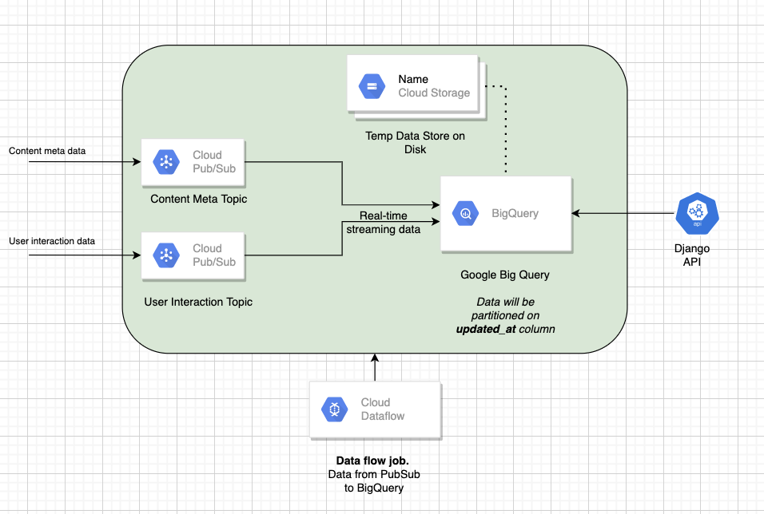

# pratilipi-assignment

## Setup

Clone the repository:

```sh
$ git clone https://github.com/gocardless/sample-django-app.git
$ cd sample-django-app
```

Then install the dependencies:


```sh 
virtualenv env_assignment
(env_assignment)$ pip install -r requirements.txt
```

And navigate to `http://127.0.0.1:8000/user_content/?user_id=65045&query_date=2022-03-27`


## Architecture
<p align="center">

</p>

## Query

Output data is driven by query. Query is performed on two table which are present inside google big query named user_interaction and content_meta.

query used:
